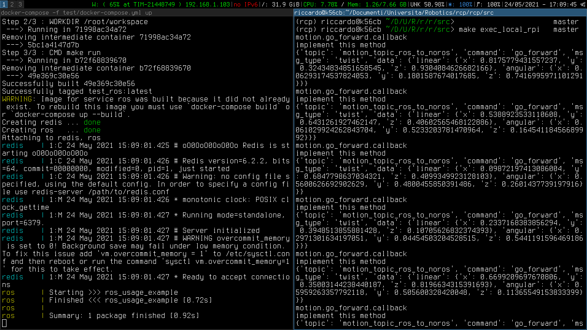
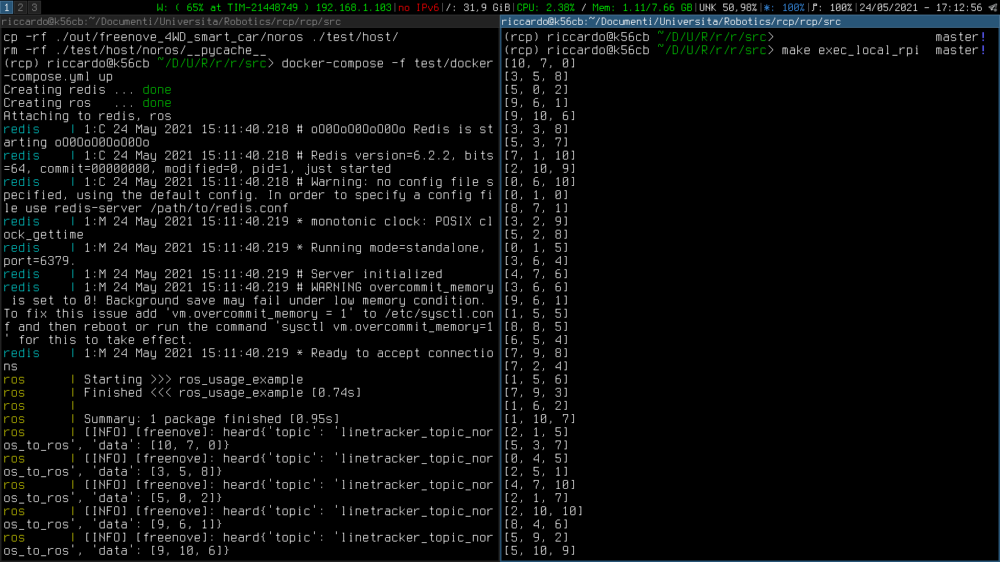

## RCP

you can follow this usage examples in order to test rcp.

remember that it is a best practise to perform a [cleaning step](#clean-the-rcp-workspace) if you are switching between examples or if you are experiencing some errors.


### Pull this repository

```console
user@host:~$ git pull https://github.com/mdegree-nedas/rcp.git
user@host:~$ cd rcp
```
- we will refer the root of this repository as ```<rcp-repo>```


### Mount and source the Python virtual environment
```console
user@host:~$ make rcp
user@host:~$ cd rcp
user@host:~$ . bin/activate
user@host:~$ cd src
```


### Example 1: actuators (both ros and host are in the same machine)
- you must have two terminals, in one terminal we will execute the ros part and in the other one we will execute the host part
- we assume that in both terminals you have already mounted and sourced the Python virtual environment
- we assume that in both terminals you are in the directory ```<rcp-repo>/rcp/src```
- terminal 1: ros part
```console
user@host:~$ make build_actuators
user@host:~$ make exec_local_ros
```

- terminal 2: host part
```console
user@host:~$ make exec_local_rpi
```

- example result:
	- on the left, the ros part terminal
	- on the right, the host part terminal




### Example 2: sensors (both ros and host are in the same machine)
- you must have two terminals, in one terminal we will execute the ros part and in the other one we will execute the host part
- we assume that in both terminals you have already mounted and sourced the Python virtual environment
- we assume that in both terminals you are in the directory ```<rcp-repo>/rcp/src```
- terminal 1: ros part
```console
user@host:~$ make build_sensors
user@host:~$ make exec_local_ros
```

- terminal 2: host part
```console
user@host:~$ make exec_local_rpi
```

- example result:
	- on the left, the ros part terminal
	- on the right, the host part terminal




### Example 3: actuators (ros in a linux/amd64 machine and host in a linux/arm/v7 Raspberry machine)
- we assume that you have pulled the repo in the two machines and you have one terminal opened in the linux/amd64 machine and the other terminal opened in the Raspberry machine
- we assume that in both terminals you have already mounted and sourced the Python virtual environment
- we assume that in both terminals you are in the directory ```<rcp-repo>/rcp/src```

#### preparation step
the robot configuration file must contain the IP of your linux/amd64 machine that contains the ros part:
- open the robot configuration file config/freenove.yml with your preferred text editor and set the field "message_broker_ip", in this field you must put the IP of the linux/amd64 machine

#### execution
- we assume that in the robot configuration file config/freenove.yml you have set the correct IP in the "message_broker_ip" field

- terminal 1: ros part (linux/amd64 machine)
```console
user@host:~$ make build_actuators
user@host:~$ make exec_remote_ros
```

- terminal 2: host part
```console
user@host:~$ make build_actuators
user@host:~$ make exec_remote_rpi
```

- example result:
	- on the left, the ros part terminal (in the linux/amd64 machine)
	- on the right, the host part terminal (in the linux/arm/v7 Raspberry machine)


### Example 4: sensors (ros in a linux/amd64 machine and host in a linux/arm/v7 Raspberry machine)
- we assume that you have pulled the repo in the two machines and you have one terminal opened in the linux/amd64 machine and the other terminal opened in the Raspberry machine
- we assume that in both terminals you have already mounted and sourced the Python virtual environment
- we assume that in both terminals you are in the directory ```<rcp-repo>/rcp/src```

#### preparation step
the robot configuration file must contain the IP of your linux/amd64 machine that contains the ros part:
- open the robot configuration file config/freenove.yml with your preferred text editor and set the field "message_broker_ip", in this field you must put the IP of the linux/amd64 machine

#### execution
- we assume that in the robot configuration file config/freenove.yml you have set the correct IP in the "message_broker_ip" field

- terminal 1: ros part (linux/amd64 machine)
```console
user@host:~$ make build_sensors
user@host:~$ make exec_remote_ros
```

- terminal 2: host part
```console
user@host:~$ make build_sensors
user@host:~$ make exec_remote_rpi
```

- example result:
	- on the left, the ros part terminal (in the linux/amd64 machine)
	- on the right, the host part terminal (in the linux/arm/v7 Raspberry machine)


### Clean the rcp workspace
- we assume that you have a terminal opened in the directory ```<rcp-repo>/rcp/src```
- we assume that you have already mounted and sourced the Python virtual environment
```console
user@host:~$ make clean
```


### Deactivate the Python virtual environment
- you will execute this step if you are exiting
- we assume that you have already cleaned the rcp workspace
- we assume that you have a terminal opened in the directory ```<rcp-repo>```
- we assume that you have already mounted and sourced the Python virtual environment
```console
user@host:~$ deactivate
user@host:~$ make clean
```

### Troubleshooting
- if you are experiencing some errors while executing the examples, [cleaning](#clean-the-rcp-workspace) the workspace maybe will help. 
- if your terminal with docker-compose is not showing results in our sensors examples, try waiting a little more. We have noticed that docker-compose tend to flush the results after some seconds.
